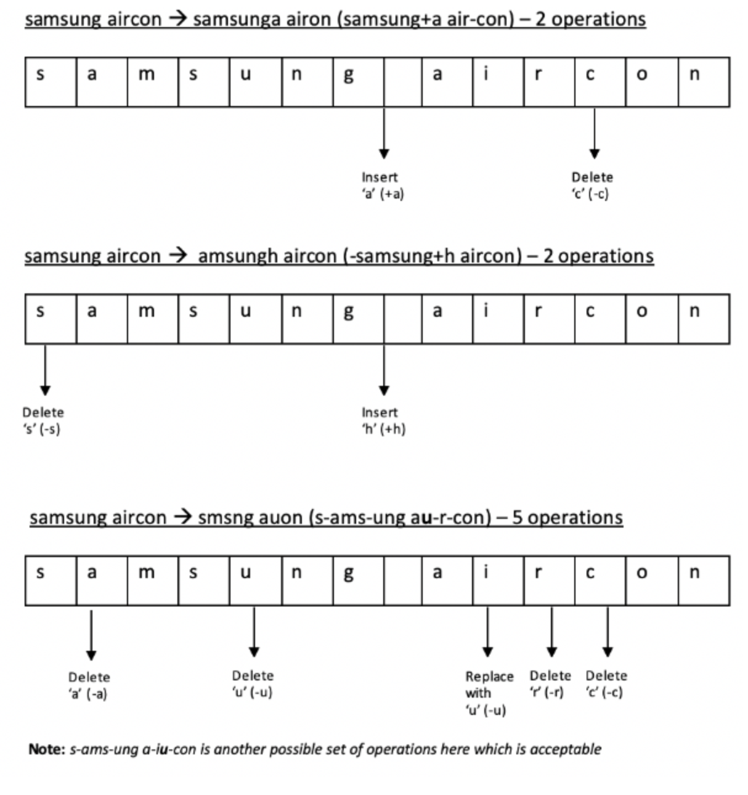

# Inventory Management

Gotham Corporation is way past its prime and has been leaking money from all the fronts. Bruce Wayne has decided to plug the leakages and wanted to make Gotham great again and appoints you as the inventory manager for the corporation. The current inventory management system search looks for exact matches, ignoring spelling mistakes in the database. This results in redundant inventory being purchased.

## Task Objective

You need to build a search algorithm which returns possible matches in case of no exact match by following the instructions given below.

Only the following operations are allowed on the search item characters to find the possible matches.

- Insertion
- Deletion
- Substitution

You should return top 10 matches (case insensitive) in the increasing order of minimum number of operations performed on the search item. You need to provide the operations performed on the search item in your result. Any possible set of operations on the search item are allowed as long as the target result is obtained by applying the operations on the search item.

If two items have same number of operations, order them alphabetically.

We will do a POST request on your team URL with the endpoint `/inventory-management` to evaluate the solution

### Sample Input
    
`[{"searchItemName":"Samsung Aircon","items":["Smsng Auon","Amsungh Aircon","Samsunga Airon"]}]`

### Sample Output
    
`[{"searchItemName":"Samsung Aircon","searchResult":["-Samsung+h Aircon","Samsung+a Air-con","S-ams-ung Au-r-con"]}]`

## Explanation
