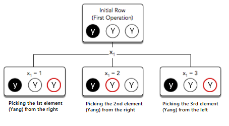
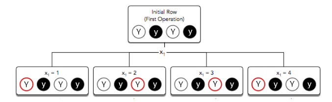
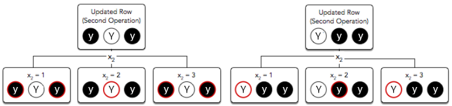

# Yin Yan

## Background

Unbeknownst to most mortals, our world exists and thrives only because of the presence of cosmically generated Yin and Yang elements which powers its core.

While most physics teachers will have you believe that the Earth spins and revolves around the Sun because of some ridiculous concept like Gravity, in reality, the Gods release an arbitrary number of Yin and Yang elements into the atmosphere which are captured by the Guardian of the Earth, Sage Ryan, who then uses his Qi to release these elements into the core. However, the balance of these elements is incredibly important, if one kind of the elements exceeds the other by even a slight amount, the world would collapse. (Dinosaurs found this out the hard way when Sage Ryan partied a bit too hard one night.)

## Problem
Every morning, Sage Ryan's ancient machine, "Element Altar" absorbs some elements from the atmosphere.

Then, depending on the current balance of elements inside the core, Sage Ryan operates the Altar and picks the elements of the desired kind and releases them to the Earth's core.

However, there are some strange, divinely ordained rules which Sage Ryan must obey while operating the Altar and hence making this elements release work incredibly arduous:

- Once ***n*** elements of Yin (displayed as 'y') or Yang (displayed as 'Y') are absorbed, they will form a single row on the Elements altar. e.g. "yYyyY" -> [yin, Yang, yin, yin, Yang]
- Elements Altar then provides an integer ***k*** which is the number of elements Ryan must pick today.
- For each picking process ***i*** where 1 ≤ ***i*** ≤ ***k***
  1. Elements Altar will generate (uniformly and independently) a random integer ***x*** between 1 and ***n*** - ***i*** + 1 (inclusive)
  2. Elements Altar will then let Ryan pick the ***x***th element **either from the left or right end of the row**, which will then reduce the number of elements in the row by one.

Suddenly, one day in the middle of the Yin season, the sky became dimmer, the weather became colder. Sage Ryan realized that the number of Yin elements in the core had catastrophically increased.

Therefore, starting from today, **he needs to release as many Yang elements as he possibly can** to the Earth's core until this seasonal Yin crisis is resolved.

However, before the picking process can commence, for every combination of elements, Sage Ryan needs to know roughly how much Qi he would need to accumulate.

Unfortunately, Sage Ryan was not a very disciplined student and slept through most of his Statistics classes. Therefore, he is hiring you to calculate the **expected number of Yang elements** he will release given that he always makes the most optimal choice of picking elements which would maximise the total number of Yang elements picked after k steps.

**Hint 1**: Ryan's goal is to maximise the total number of Yang elements released to the core and hence, sometimes he would need to pick a Yin element (rather than Yang) and throw it away if he thinks it would give him a higher probability to pick more Yang elements later on. Therefore, while designing a solution, always picking a Yang element may not be the most accurate strategy.

**Hint 2**: Look at [Expected Value](https://en.wikipedia.org/wiki/Expected_value)

## Endpoint
Provide a `POST` endpoint `/yin-yang` that given 1 set of input will return 1 set of output

### Input
The `HTTP POST` request will come with a body of `Content-Type: application/json`.

```
{
    "number_of_elements" : n,
    "number_of_operations" : k,
    "elements" :  E,
}
```

### Output
The expected `HTTP` response will come with a body of `Content-Type: application/json` containing

```
{
    result : (The expected number of Yang elements picked)
}
```

## Constraints
- 1 ≤ ***k*** ≤ ***n*** ≤ 30
- HTTP Request Timeout: 5 seconds

## Examples

### Sample Input 1

```
{
    "number_of_elements" : 3,
    "number_of_operations" : 1,
    "elements" :  "yYY"
}
```

### Sample Output 1

```
1.0000000000
```

### Explanation 1


Independent of ***x***, a Yang element will always be picked by Ryan, so, the expected number of Yang elements chosen after the ***k*** = 1 operation is 1. Since Ryan is only required to do one operation, the answer to this problem is 1.

### Sample Input 2

```
{
    "number_of_elements" : 4,
    "number_of_operations" : 2,
    "elements" :  "YyYy"
}
```

### Sample Output 2

```
1.5000000000
```

### Explanation 2


Independent of ***x***, a Yang element will always be picked by Ryan, so, the expected number of Yang elements chosen after the ***k*** = 1 operation is 1.

For the second operation, there are two possible orderings of Yin and Yang elements (depending on which Yang element was picked in the first operation):



In the first possible elements ordering, the probability of picking a Yang Element is ⅓. In the second possible elements ordering, the probability of picking a Yang element is ⅔. This means the expected number of Yang elements chosen in the second operation is ½ * ⅓ + ½ * ⅔ = ½. After performing both the operations, the total expected number of Yang elements is 1 + ½ = 1.5.